# Spediak Deployment Monitoring & Auto-Verification

## 🎯 Overview

Automated system to verify that Vercel (frontend) and Render (backend) deployments are healthy and working correctly after each push to GitHub.

---

## 🔧 What Was Set Up

### 1. Backend Health Endpoints

**Endpoint: `/health`**
- Quick health check
- Checks database, Cloudinary, OpenAI, Clerk configuration
- Returns JSON with status of all services
- Response time: < 1 second

**Endpoint: `/health/detailed`**
- Comprehensive health check
- Verifies all 14 database tables exist
- Checks recent activity (inspections, users, ads)
- Lists missing environment variables
- Response time: < 3 seconds

**Endpoint: `/ping`**
- Simple alive check
- Fastest response
- Used for uptime monitoring

### 2. Frontend Health Page

**URL: `https://your-app.vercel.app/health`**
- Visual dashboard showing system status
- Checks both frontend and backend
- Auto-refreshes every 30 seconds
- Shows all service statuses with icons

### 3. Automated Verification Script

**File: `scripts/verify-deployment.js`**
- Runs comprehensive checks
- Can be called manually or in CI/CD
- Colored terminal output
- Exit code 0 if healthy, 1 if issues

### 4. GitHub Actions Workflow

**File: `.github/workflows/deployment-check.yml`**
- Runs automatically on every push to main
- Waits for Vercel deployment
- Checks frontend accessibility
- Checks backend health
- Runs integration tests
- Creates status summary
- Runs every 6 hours (scheduled)

---

## 📋 How to Use

### Automatic Verification (After Every Push):

1. **Push to GitHub:**
   ```bash
   git push origin main
   ```

2. **GitHub Actions automatically:**
   - Waits 60 seconds for Vercel deployment
   - Checks frontend is accessible
   - Checks backend health endpoints
   - Verifies database schema
   - Runs integration tests
   - Reports success/failure

3. **Check Results:**
   - Go to GitHub → Actions tab
   - See latest workflow run
   - View detailed logs and summary

### Manual Verification:

**Option 1: Using the script**
```bash
node scripts/verify-deployment.js
```

**Option 2: Using the script with custom URLs**
```bash
node scripts/verify-deployment.js \
  --frontend https://app.spediak.com \
  --backend https://api.spediak.com
```

**Option 3: Browser health page**
```
Visit: https://your-app.vercel.app/health
```

**Option 4: Direct API calls**
```bash
# Quick check
curl https://your-backend.onrender.com/health

# Detailed check
curl https://your-backend.onrender.com/health/detailed

# Ping
curl https://your-backend.onrender.com/ping
```

---

## 🚀 Setup Instructions

### Step 1: Configure GitHub Secrets

Go to GitHub Repository → Settings → Secrets and variables → Actions

Add these secrets:
```
FRONTEND_URL = https://app-spediak.vercel.app
BACKEND_URL = https://your-backend.onrender.com
```

### Step 2: Update Health Check URLs

**In `scripts/verify-deployment.js`:**
```javascript
const FRONTEND_URL = process.env.FRONTEND_URL || 'https://app-spediak.vercel.app';
const BACKEND_URL = process.env.BACKEND_URL || 'https://your-backend.onrender.com';
```

**In `app-spediak/Spediak/public/health.html`:**
```javascript
const BACKEND_URL = 'https://your-backend.onrender.com';
```

### Step 3: Enable GitHub Actions

The workflow is already created. It will run automatically on:
- Every push to main
- Manual trigger (workflow_dispatch)
- Every 6 hours (scheduled)

### Step 4: Test Locally

```bash
# Test the verification script
node scripts/verify-deployment.js

# Expected output:
# ✅ Frontend is healthy
# ✅ Backend is healthy
# ✅ Database schema complete
# ✅ Integration working
# 🎉 ALL SYSTEMS HEALTHY!
```

---

## 📊 What Gets Checked

### Frontend (Vercel):
- ✅ Site is accessible (HTTP 200)
- ✅ Response time < 3 seconds
- ✅ Build deployed successfully

### Backend (Render):
- ✅ API is accessible
- ✅ Database connection working
- ✅ Cloudinary configured
- ✅ OpenAI configured
- ✅ Clerk configured
- ✅ Discord configured (optional)
- ✅ Response time < 3 seconds

### Database Schema:
- ✅ All 14 tables exist
- ✅ users
- ✅ inspections
- ✅ prompts, prompt_versions
- ✅ knowledge_documents, knowledge_chunks
- ✅ user_profiles
- ✅ user_subscriptions
- ✅ sop_documents, sop_assignments, sop_history
- ✅ ad_inventory
- ✅ admin_audit_log
- ✅ discord_connections

### Integration:
- ✅ Frontend can reach backend
- ✅ CORS configured correctly
- ✅ API responses valid

### Environment:
- ✅ All required env vars set
- ⚠️ Warns if any missing

### Activity:
- 📊 Inspections in last 24h
- 📊 Total users
- 📊 Active ads

---

## 🔔 Notifications

### Success:
When all checks pass, you'll see:
```
🎉 ALL SYSTEMS HEALTHY!
✅ Frontend (Vercel) is live
✅ Backend (Render) is operational
✅ Database schema is complete
✅ Frontend-Backend integration working
🚀 Deployment is successful and ready for users!
```

### Failure:
When issues detected:
```
⚠️  ISSUES DETECTED:
❌ Backend has issues
   Error: Connection timeout
⚠️  Backend configuration incomplete
   Missing tables: user_subscriptions, sop_documents
📖 Check the detailed output above for specific issues.
```

---

## 🛠️ Advanced Configuration

### Add Slack Notifications:

Add to `.github/workflows/deployment-check.yml`:
```yaml
- name: Notify Slack on Failure
  if: failure()
  uses: slackapi/slack-github-action@v1
  with:
    webhook-url: ${{ secrets.SLACK_WEBHOOK_URL }}
    payload: |
      {
        "text": "❌ Spediak deployment verification failed!",
        "blocks": [
          {
            "type": "section",
            "text": {
              "type": "mrkdwn",
              "text": "Deployment health check failed. Check GitHub Actions for details."
            }
          }
        ]
      }
```

### Add Discord Notifications:

```yaml
- name: Notify Discord on Failure
  if: failure()
  run: |
    curl -X POST "${{ secrets.DISCORD_WEBHOOK_URL }}" \
      -H "Content-Type: application/json" \
      -d '{"content": "❌ Spediak deployment verification failed! Check GitHub Actions."}'
```

### Add Email Notifications:

```yaml
- name: Send Email on Failure
  if: failure()
  uses: dawidd6/action-send-mail@v3
  with:
    server_address: smtp.gmail.com
    server_port: 465
    username: ${{ secrets.MAIL_USERNAME }}
    password: ${{ secrets.MAIL_PASSWORD }}
    subject: Spediak Deployment Failed
    to: your-email@example.com
    from: Spediak CI/CD
    body: Deployment verification failed. Check GitHub Actions for details.
```

---

## 📈 Monitoring Dashboard

### Create a Status Page:

**Option 1: Use health.html**
- Already created at `/health`
- Shows real-time status
- Auto-refreshes
- No additional setup needed

**Option 2: Use Betteruptime/Pingdom**
- Monitor: `https://your-backend.onrender.com/ping`
- Alert on downtime
- Historical uptime data

**Option 3: Custom Dashboard**
- Build using health API data
- Show historical trends
- Alert on anomalies

---

## 🔍 Troubleshooting

### If GitHub Actions Fails:

**Check 1: URLs are correct**
```bash
# Test manually:
curl https://app-spediak.vercel.app
curl https://your-backend.onrender.com/health
```

**Check 2: Secrets are set**
- Go to GitHub Settings → Secrets
- Verify FRONTEND_URL and BACKEND_URL exist

**Check 3: Vercel build succeeded**
- Check Vercel dashboard
- View deployment logs
- Ensure no build errors

**Check 4: Render service is up**
- Check Render dashboard
- Verify service is running
- Check recent logs

### If Health Check Shows Unhealthy:

**Missing Tables:**
```bash
# SSH into Render or run locally:
cd app-spediak/backend
node scripts/run-migrations.js
```

**Missing Environment Variables:**
- Go to Render dashboard
- Add missing variables
- Redeploy service

**Database Connection Issues:**
- Verify DATABASE_URL is correct
- Check Neon database is not paused
- Test connection manually

---

## 🎯 CI/CD Pipeline Flow

```mermaid
graph TD
    A[Push to GitHub] --> B[Vercel Auto Deploy]
    A --> C[GitHub Actions Triggered]
    B --> D[Vercel Build]
    D --> E[Vercel Deploy]
    C --> F[Wait 60 seconds]
    F --> G[Check Frontend Health]
    F --> H[Check Backend Health]
    G --> I[Frontend Tests]
    H --> J[Backend Tests]
    I --> K{All Pass?}
    J --> K
    K -->|Yes| L[✅ Notify Success]
    K -->|No| M[❌ Notify Failure]
    L --> N[Update Status Badge]
    M --> N
```



---

## 📊 Health Check API Response Examples

### `/health` Response:
```json
{
  "timestamp": "2026-01-04T19:30:00.000Z",
  "status": "healthy",
  "service": "spediak-backend",
  "version": "2.0.0",
  "checks": {
    "database": {
      "status": "healthy",
      "responseTime": "45ms"
    },
    "cloudinary": {
      "status": "configured",
      "cloud_name": "configured"
    },
    "openai": {
      "status": "configured"
    },
    "clerk": {
      "status": "configured"
    }
  }
}
```

### `/health/detailed` Response:
```json
{
  "timestamp": "2026-01-04T19:30:00.000Z",
  "status": "healthy",
  "deployment": "spediak-backend-prod",
  "checks": {
    "database_schema": {
      "status": "healthy",
      "tables_found": 14,
      "tables_required": 14,
      "missing_tables": []
    },
    "activity": {
      "status": "healthy",
      "inspections_last_24h": 42,
      "total_users": 156,
      "active_ads": 3
    },
    "environment": {
      "status": "healthy",
      "variables": {
        "DATABASE_URL": true,
        "OPENAI_API_KEY": true,
        "CLERK_SECRET_KEY": true,
        "CLOUDINARY_CLOUD_NAME": true
      }
    }
  }
}
```

---

## 🎯 Quick Commands

### Check Everything:
```bash
node scripts/verify-deployment.js
```

### Check Just Frontend:
```bash
curl -I https://app-spediak.vercel.app
```

### Check Just Backend:
```bash
curl https://your-backend.onrender.com/health | jq '.'
```

### Check Database Schema:
```bash
curl https://your-backend.onrender.com/health/detailed | jq '.checks.database_schema'
```

### Check Environment:
```bash
curl https://your-backend.onrender.com/health/detailed | jq '.checks.environment'
```

---

## 🚨 Alerts & Monitoring

### Recommended Setup:

1. **GitHub Actions** (Already configured)
   - Runs on every push
   - Email notifications built-in

2. **UptimeRobot** (Free tier)
   - Monitor: `/ping` endpoint
   - Check every 5 minutes
   - Email/SMS on downtime

3. **Render Health Checks** (Built-in)
   - Enable in Render dashboard
   - Uses `/health` endpoint
   - Auto-restart on failure

4. **Vercel Analytics** (Built-in)
   - Monitor frontend performance
   - Track Core Web Vitals
   - Alert on errors

---

## ✅ Success Criteria

Your deployment is healthy when:
- ✅ Frontend returns HTTP 200
- ✅ Backend `/health` returns HTTP 200
- ✅ All services show "healthy" or "configured"
- ✅ Database has all 14 tables
- ✅ No missing environment variables
- ✅ Recent activity shows app is being used

---

## 📞 Getting Alerts

### Option 1: GitHub Actions (Free)
- Automatic on every push
- Email notifications
- See results in Actions tab

### Option 2: Add to Render
- Dashboard → Your Service → Health Check Path
- Set: `/health`
- Frequency: Every 60 seconds
- Auto-restart on 3 failures

### Option 3: External Monitoring
- UptimeRobot: https://uptimerobot.com
- Pingdom: https://www.pingdom.com
- StatusCake: https://www.statuscake.com

All can hit `/health` or `/ping` endpoints.

---

## 🎉 Result

Now you have:
✅ **Automated health checks** on every deployment  
✅ **GitHub Actions workflow** running tests  
✅ **Visual health dashboard** at /health  
✅ **API endpoints** for monitoring tools  
✅ **Verification script** for manual checks  
✅ **Detailed schema validation**  
✅ **Environment variable checking**  
✅ **Integration testing**  

**Your deployments are now automatically verified! 🚀**

